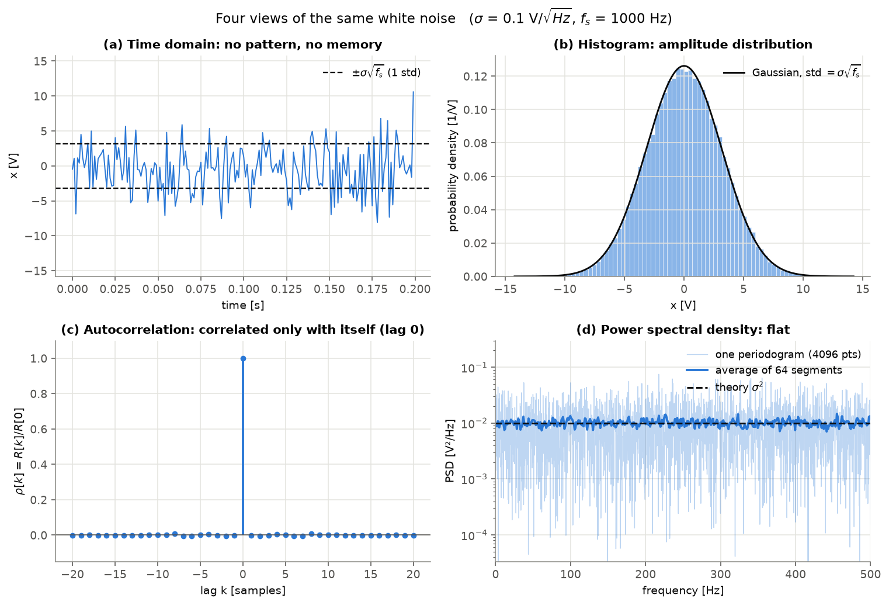
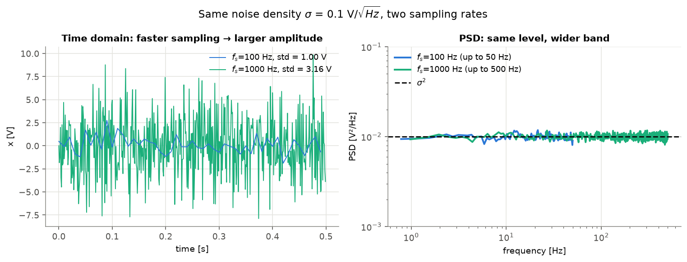
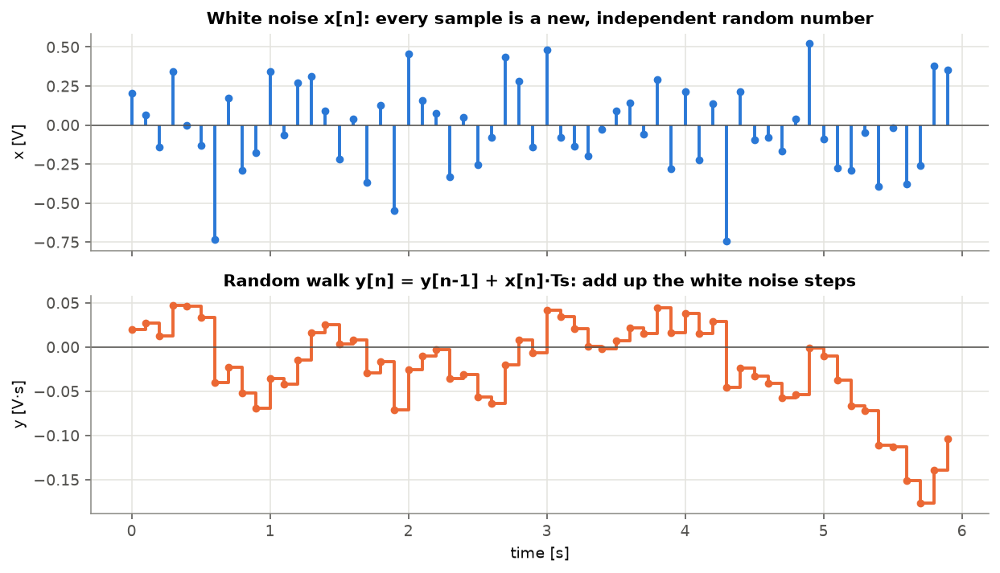
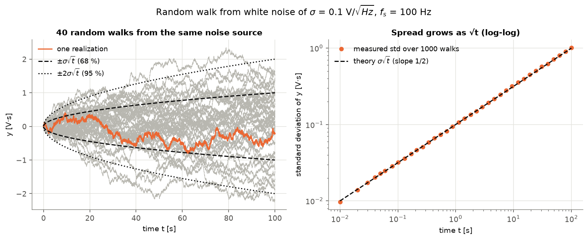
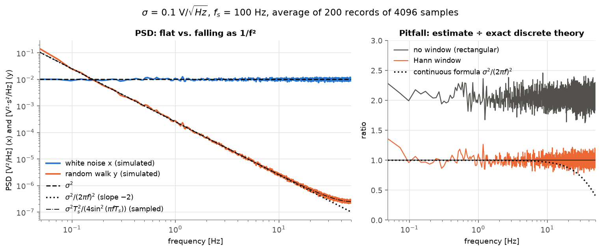

# White Noise and Random Walk — A Beginner's Guide

White noise and random walk are the two most basic noise models in sensor signal processing, and they are closely related:

> **A random walk is white noise added up over time.**
> White noise has no memory; a random walk remembers every step it has taken.

This page explains both from scratch, with simulations you can reproduce. All figures are generated by [`misc/noise_basics.py`](../misc/noise_basics.py):

```bash
uv run python misc/noise_basics.py
```

---

## 0. Conventions used on this page

- $f_s$ is the sampling rate [Hz] and $T_s = 1/f_s$ is the sampling interval [s].
- A signal $x$ is measured in volts [V]. Any physical unit (°/s, m/s², …) works the same way.
- $\sigma$ is the **noise density** in $\mathrm{V}/\sqrt{\mathrm{Hz}}$. It is defined with a **two-sided** power spectral density (PSD), which covers both positive and negative frequencies:

$$
S_x(f) = \sigma^2 \quad [\mathrm{V^2/Hz}], \qquad -\tfrac{f_s}{2} < f < \tfrac{f_s}{2}
$$

> **Caution — one-sided vs. two-sided.** Many datasheets quote a *one-sided* density $N_1$, meaning the PSD is defined only for $f \ge 0$. The power is the same, so $N_1^2 = 2\sigma^2$, or $\sigma = N_1/\sqrt{2}$. Always check which convention a number uses; mixing them up gives an error of $\sqrt{2}$ in amplitude.

---

## 1. White noise

### 1.1 Definition

A discrete-time signal $x[n]$ is **white noise** when:

1. its mean is zero: $E[x[n]] = 0$, and
2. samples at different times are **uncorrelated**: $E[x[n]\,x[m]] = 0$ for $n \ne m$.

Its autocorrelation is therefore a single spike at lag 0:

$$
R_x[k] = E[x[n]\,x[n+k]] = \sigma^2 f_s \,\delta[k]
$$

The PSD is the Fourier transform of the autocorrelation. The Fourier transform of a spike is a constant, so the PSD is **flat**: every frequency carries the same power. The name "white" comes from white light, which contains all colors equally.

> **White ≠ Gaussian.** "White" describes the *correlation* (or the spectrum). "Gaussian" describes the *amplitude distribution*. They are independent properties. The most common model is *Gaussian* white noise: independent samples from a normal distribution. We use it below.

In continuous time, the idealized form is $R_x(\tau) = \sigma^2\,\delta(\tau)$. This ideal signal has infinite total power, because a flat spectrum extends to infinite frequency. It exists only as a mathematical model. Real signals are always band-limited, for example by sampling.

### 1.2 How to simulate it

Total power is the area under the PSD. After sampling, the band is $-f_s/2 \dots f_s/2$, so

$$
\mathrm{Var}(x[n]) = \int_{-f_s/2}^{f_s/2} \sigma^2 \, df = \sigma^2 f_s
$$

To produce a noise density $\sigma$, generate

$$
x[n] = \sigma\sqrt{f_s}\; w[n] = \frac{\sigma}{\sqrt{T_s}}\, w[n], \qquad w[n] \sim \mathcal{N}(0, 1) \text{ independent}
$$

```python
x = sigma * np.sqrt(fs) * rng.standard_normal(n)
```

### 1.3 Four views of white noise



- **(a) Time domain.** The signal jumps around with no visible pattern. Knowing the current sample tells you nothing about the next one.
- **(b) Histogram.** The amplitudes follow a Gaussian with standard deviation $\sigma\sqrt{f_s}$ (here $0.1 \times \sqrt{1000} \approx 3.16$ V).
- **(c) Autocorrelation.** $\rho[0] = 1$ and $\rho[k] \approx 0$ for every other lag. This is the definition of "white".
- **(d) PSD.** The spectrum is flat at $\sigma^2 = 0.01\ \mathrm{V^2/Hz}$.

  The light curve is a *single* periodogram (the squared magnitude of one FFT). It scatters by a factor of 10 or more around the true value. For Gaussian white noise, each periodogram bin follows an exponential distribution whose standard deviation equals its mean. **Using a longer FFT does not reduce this scatter; it only gives more bins.** To get a smooth estimate, average the periodograms of many segments (Welch's method). Averaging $K$ segments reduces the relative scatter to $1/\sqrt{K}$.

### 1.4 The most common confusion: amplitude depends on sampling rate, density does not



Both signals come from the **same** noise source ($\sigma = 0.1\ \mathrm{V}/\sqrt{\mathrm{Hz}}$):

| | $f_s = 100$ Hz | $f_s = 1000$ Hz |
|---|---|---|
| Standard deviation $\sigma\sqrt{f_s}$ | 1.00 V | 3.16 V |
| PSD level | $0.01\ \mathrm{V^2/Hz}$ | $0.01\ \mathrm{V^2/Hz}$ |
| Frequency range | up to 50 Hz | up to 500 Hz |

Faster sampling lets in a wider band of the same flat spectrum. The total power, which is the area under the PSD, grows, so the samples look bigger. The *noise density* is the property of the source; the standard deviation is not. This is why sensor datasheets specify noise as a density (e.g. µg/√Hz, (°/s)/√Hz).

The reverse also holds. A low-pass filter with (noise-equivalent) bandwidth $B$ reduces the standard deviation to about $\sigma\sqrt{2B}$ (two-sided convention). This is why filtering reduces white noise. See [White Noise — Filtering](./white_noise.md#filtering).

---

## 2. Random walk

### 2.1 Definition

A **random walk** $y$ is the running sum (integral) of white noise:

$$
y[n] = y[n-1] + T_s\, x[n], \qquad y[0] = 0
\qquad\Longleftrightarrow\qquad
\frac{dy}{dt} = x(t)
$$

The factor $T_s$ turns the sum into an integral, so the result does not depend on the sampling rate. In code:

```python
y = np.cumsum(x) / fs
```



Each white-noise sample (top) is one *step*. The random walk (bottom) is the *position* after all steps so far. Because every past step is kept, the random walk has **memory**: neighboring values are strongly correlated, and the curve wanders instead of jumping back and forth around zero.

### 2.2 The spread grows as $\sqrt{t}$

The steps are independent, so their variances add. After $n$ steps (time $t = nT_s$):

$$
\mathrm{Var}(y[n]) = n \cdot T_s^2 \cdot \mathrm{Var}(x) = n \cdot T_s^2 \cdot \sigma^2 f_s = \sigma^2\, n T_s = \sigma^2\, t
$$

$$
\boxed{\ \mathrm{std}\big(y(t)\big) = \sigma\sqrt{t}\ }
$$

The sampling rate cancels out: the random walk depends only on the noise density $\sigma$ and the elapsed time $t$.



- **Left:** 40 walks from the same noise source. The mean stays at zero, but the paths fan out. About 68 % stay inside $\pm\sigma\sqrt{t}$ and about 95 % inside $\pm 2\sigma\sqrt{t}$. Each individual path looks as if it has a "trend" or "drift", but it is only accumulated noise. A different realization drifts somewhere else.
- **Right:** The measured standard deviation over 1000 walks is a straight line of slope $1/2$ on a log-log plot. This is the signature of a random walk.

Because the variance keeps growing, a random walk is **non-stationary**: its statistics change with time. White noise is stationary.

> **Note: $\sqrt{t}$ grows slower than $t$.** Doubling the time increases the typical error by only $\sqrt{2} \approx 1.41$. The error still has no upper bound.

### 2.3 Spectrum: $1/f^2$

In the frequency domain, integration is division by $j2\pi f$:

$$
Y(f) = \frac{X(f)}{j2\pi f}
\qquad\Rightarrow\qquad
S_y(f) = \frac{S_x(f)}{(2\pi f)^2} = \frac{\sigma^2}{(2\pi f)^2}
$$

On a log-log plot this is a straight line with **slope −2**. Low frequencies (slow wandering) dominate. Because of this steep slope, random walk is also called *brown(ian)* or *red* noise.

For a **sampled** random walk the exact result is slightly different. The discrete sum $1/(1 - e^{-j2\pi f T_s})$ replaces the ideal integrator $1/(j2\pi f)$:

$$
S_y(f) = \frac{\sigma^2 T_s^2}{4\sin^2(\pi f T_s)}
$$

This equals $\sigma^2/(2\pi f)^2$ for $f \ll f_s$. At the Nyquist frequency it is about 2.5× larger.



- **Left:** The white noise is flat. The random walk falls as $1/f^2$ and bends up slightly near $f_s/2$, as the sampled formula predicts. (The two curves have different units, $\mathrm{V^2/Hz}$ and $\mathrm{V^2 s^2/Hz}$, so the point where they cross has no special meaning.)
- **Right — a pitfall.** Strictly speaking, a non-stationary process has no PSD. The formula above describes what a careful spectral estimate of a finite record converges to. The estimator matters:
  - **No window (rectangular):** the estimate is about **2× too high at every frequency**. The FFT treats the record as periodic. A random walk ends somewhere other than where it started, so the FFT sees a jump at the boundary. That jump also has a $1/f^2$ spectrum and adds itself on top of the real one. Because the slope is the same, **the error cannot be seen from the shape of the curve.**
  - **Hann window:** the window tapers the ends to zero, removing the jump. The estimate then matches the theory (the lowest few bins are still slightly affected).

---

## 3. Side-by-side summary

| | White noise $x$ | Random walk $y$ |
|---|---|---|
| Definition | independent samples | $y[n] = y[n-1] + T_s x[n]$, $\dot y = x$ |
| Memory | none | remembers every past step |
| Stationary? | yes | no (variance grows) |
| Sample std | $\sigma\sqrt{f_s}$ (depends on $f_s$) | $\sigma\sqrt{t}$ (depends on elapsed time) |
| PSD (two-sided) | $\sigma^2$ (flat) | $\sigma^2/(2\pi f)^2$ |
| log-log PSD slope | 0 | −2 |
| Allan deviation $\sigma_A(\tau)$ | $\sigma/\sqrt{\tau}$ (slope −1/2) | $\sigma\sqrt{\tau/3}$ (slope +1/2) |

The Allan deviation row uses the IEEE Std 952 convention, in which the PSD is two-sided, as on this page. Allan variance will be covered on its own page.

---

## 4. A practical example: gyroscope angle random walk

A gyroscope measures angular rate $\omega$ [°/s]. Its output noise is, to a first approximation, white with density $\sigma$ in $(°/\mathrm{s})/\sqrt{\mathrm{Hz}}$. To get an angle, you integrate the rate. The integrated noise is a random walk, called **angle random walk (ARW)**.

With $\sigma = 0.01\ (°/\mathrm{s})/\sqrt{\mathrm{Hz}}$ (two-sided), the angle error after one hour ($t = 3600$ s) is

$$
\mathrm{std}(\theta) = \sigma\sqrt{t} = 0.01 \times \sqrt{3600} = 0.6°
$$

Units check: $(°/\mathrm{s})/\sqrt{\mathrm{Hz}} = °/\sqrt{\mathrm{s}}$, and multiplying by $\sqrt{\mathrm{s}}$ gives degrees. The same number is often written as ARW $= 0.01\ °/\sqrt{\mathrm{s}} = 0.6\ °/\sqrt{\mathrm{h}}$. Averaging the samples more or sampling faster does not change it; only a better sensor (smaller $\sigma$) or an external reference does.

---

## 5. Key takeaways

1. **White noise** = uncorrelated samples = flat PSD. Describe it by its **noise density** $\sigma$, not its standard deviation; the standard deviation $\sigma\sqrt{f_s}$ depends on the sampling rate.
2. **Random walk** = integrated white noise. It spreads as $\sigma\sqrt{t}$ and its PSD falls as $1/f^2$.
3. To estimate a PSD, **average** many segments, and **window** the data (Hann) when the spectrum is steep, as it is for a random walk.
4. State whether a density is **one-sided or two-sided**; the two differ by $\sqrt{2}$.
